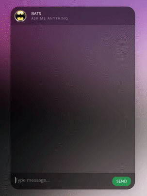

# chatbot
seq2seq chatbot in python using Tensorflow. Tensorflow is one of the best deep learning algorithm till date. 

Contact me for demo or customization. 

# Seq2Seq
Sequence To Sequence model introduced in Learning Phrase Representations using RNN Encoder-Decoder for Statistical Machine Translation has since then, become the Go-To model for Dialogue Systems and Machine Translation. It consists of two RNNs (Recurrent Neural Network) : An Encoder and a Decoder. The encoder takes a sequence(sentence) as input and processes one symbol(word) at each timestep. Its objective is to convert a sequence of symbols into a fixed size feature vector that encodes only the important information in the sequence while losing the unnecessary information. You can visualize data flow in the encoder along the time axis, as the flow of local information from one end of the sequence to another.

Image borrowed from farizrahman4u/seq2seq

Each hidden state influences the next hidden state and the final hidden state can be seen as the summary of the sequence. This state is called the context or thought vector, as it represents the intention of the sequence. From the context, the decoder generates another sequence, one symbol(word) at a time. Here, at each time step, the decoder is influenced by the context and the previously generated symbols.

 

Image borrowed from Deep Learning for Chatbots : Part 1

There are a few challenges in using this model. The most disturbing one is that the model cannot handle variable length sequences. It is disturbing because almost all the sequence-to-sequence applications, involve variable length sequences. The next one is the vocabulary size. The decoder has to run softmax over a large vocabulary of say 20,000 words, for each word in the output. That is going to slow down the training process, even if your hardware is capable of handling it. Representation of words is of great importance. How do you represent the words in the sequence? Use of one-hot vectors means we need to deal with large sparse vectors due to large vocabulary and there is no semantic meaning to words encoded into one-hot vectors. Lets look into how we can face these challenges, one by one.

#Demo

